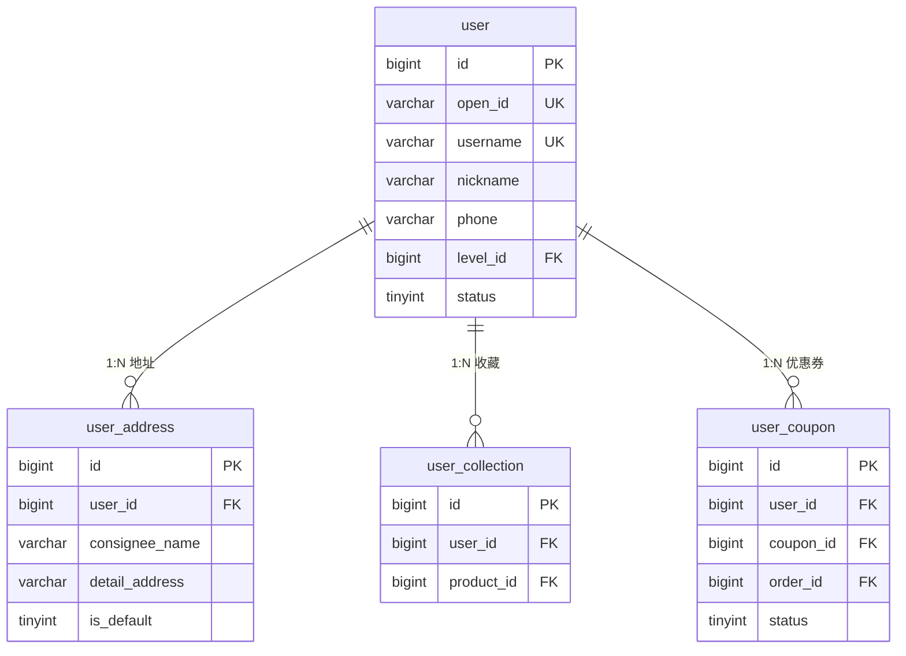
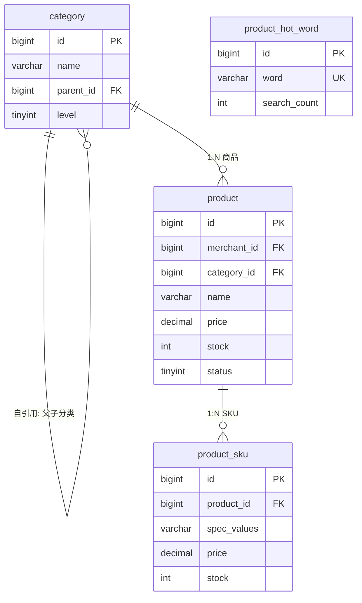
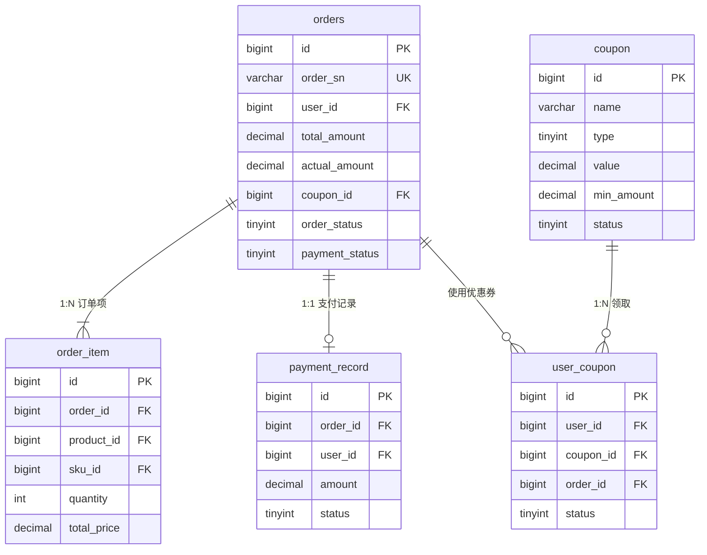
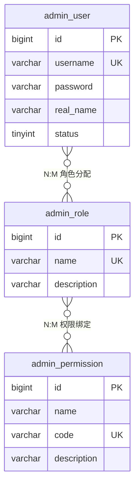
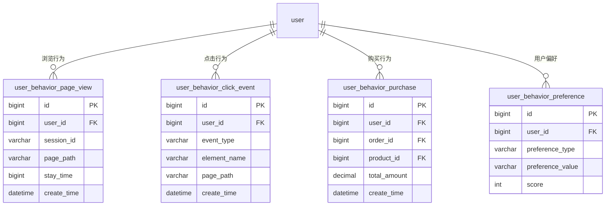
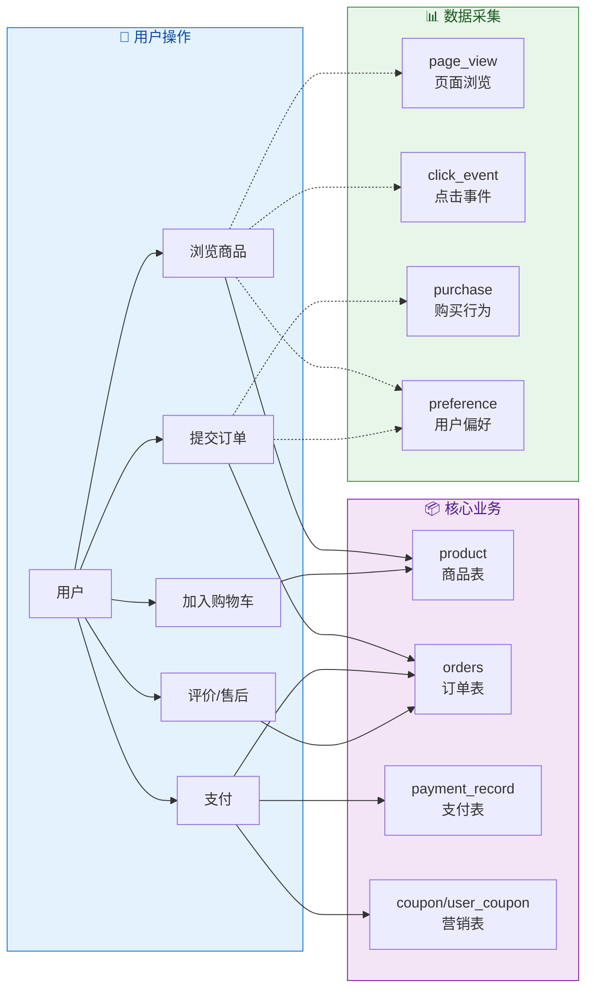

# 黑科易购 - 数据库ER关系图

> **版本**: v1.0.0 | **状态**: Active | **分类**: 数据库设计
> **创建日期**: 2026-04-05 | **最后更新**: 2026-04-05
> **维护者**: 黑科易购开发团队
> **关联文档**: [数据库设计文档](database/数据库设计文档.md) v1.2.0

---

## 变更记录

| 版本 | 日期 | 变更内容 | 作者 |
|------|------|----------|------|
| v1.0.0 | 2026-04-05 | 初始版本，完整ER关系图 + Mermaid图表 | AI助手 |

---

## 1. 数据库总览

| 数据库名称 | 类型 | 字符集 | 用途 |
|-----------|------|--------|------|
| `heikeji_mall` | MySQL 8.0+ | utf8mb4 | 核心业务数据 |
| `heikeji_mall_analytics` | MySQL 8.0+ | utf8mb4 | 用户行为分析(可分离) |

### 表数量统计

| 模块 | 表数 | 说明 |
|------|------|------|
| 用户模块 | 3 | user / user_address / user_collection |
| 商品模块 | 4 | category / product / product_sku / product_hot_word |
| 订单模块 | 2 | orders / order_item |
| 支付模块 | 1 | payment_record |
| 营销模块 | 2 | coupon / user_coupon |
| 系统管理 | 3 | admin_user / admin_role / admin_permission |
| 行为分析 | 4 | page_view / click_event / purchase / preference |
| **合计** | **19** | |

---

## 2. 完整ER关系图 (Mermaid)

> 以下ER图可在支持Mermaid的编辑器（如VS Code、GitHub、GitLab）中直接渲染。

```mermaid
erDiagram
    %% ========== 用户模块 ==========
    user {
        bigint id PK "用户ID"
        varchar open_id UK "微信openId"
        varchar username UK "用户名"
        varchar password "密码(BCrypt)"
        varchar nickname "昵称"
        varchar avatar "头像URL"
        tinyint gender "性别:0/1/2"
        varchar phone "手机号"
        varchar email "邮箱"
        varchar student_id "学号"
        bigint level_id FK "会员等级ID"
        tinyint status "状态:0正常/1禁用"
        datetime last_login_time "最后登录时间"
        datetime create_time "创建时间"
    }

    user_address {
        bigint id PK "地址ID"
        bigint user_id FK "用户ID"
        varchar consignee_name "收货人姓名"
        varchar consignee_phone "收货人手机"
        varchar province "省份"
        varchar city "城市"
        varchar district "区县"
        varchar detail_address "详细地址"
        tinyint is_default "是否默认地址"
        datetime create_time "创建时间"
    }

    user_collection {
        bigint id PK "收藏ID"
        bigint user_id FK "用户ID"
        bigint product_id FK "商品ID"
        datetime create_time "收藏时间"
    }

    %% ========== 商品模块 ==========
    category {
        bigint id PK "分类ID"
        varchar name "分类名称"
        bigint parent_id FK "父分类ID"
        tinyint level "级别:1/2/3"
        int sort_order "排序序号"
        varchar icon "分类图标"
        tinyint status "状态"
        datetime create_time "创建时间"
    }

    product {
        bigint id PK "商品ID"
        bigint merchant_id FK "商家ID"
        bigint category_id FK "分类ID"
        varchar name "商品名称"
        varchar subtitle "副标题"
        text description "商品描述"
        varchar main_image "主图URL"
        decimal price "商品价格"
        int stock "库存"
        int sales "销量"
        tinyint status "状态:0上架/1下架"
        tinyint is_new "是否新品"
        tinyint is_hot "是否热销"
        datetime create_time "创建时间"
    }

    product_sku {
        bigint id PK "SKU ID"
        bigint product_id FK "商品ID"
        varchar spec_values "规格值组合"
        decimal price "SKU价格"
        int stock "SKU库存"
        varchar sku_image "SKU图片"
        datetime create_time "创建时间"
    }

    product_hot_word {
        bigint id PK "主键ID"
        varchar word UK "热词内容"
        int search_count "搜索次数"
        tinyint status "状态"
        tinyint show_on_home "首页显示"
        int sort_order "排序"
        datetime create_time "创建时间"
    }

    %% ========== 订单模块 ==========
    orders {
        bigint id PK "订单ID"
        varchar order_sn UK "订单编号"
        bigint user_id FK "用户ID"
        bigint merchant_id FK "商家ID"
        decimal total_amount "订单总金额"
        decimal actual_amount "实际支付金额"
        bigint coupon_id FK "优惠券ID"
        decimal coupon_amount "优惠金额"
        tinyint payment_method "支付方式"
        tinyint payment_status "支付状态"
        tinyint order_status "订单状态"
        bigint shipping_id FK "配送地址ID"
        varchar consignee_name "收货人姓名"
        varchar consignee_phone "收货人手机"
        varchar shipping_address "收货地址"
        datetime payment_time "支付时间"
        datetime delivery_time "发货时间"
        datetime confirm_time "确认收货时间"
        datetime create_time "创建时间"
    }

    order_item {
        bigint id PK "订单商品ID"
        bigint order_id FK "订单ID"
        bigint product_id FK "商品ID"
        bigint sku_id FK "SKU ID"
        varchar product_name "商品名称"
        varchar product_image "商品图片"
        varchar spec_info "规格信息"
        decimal price "单价"
        int quantity "购买数量"
        decimal total_price "商品总价"
        datetime create_time "创建时间"
    }

    %% ========== 支付模块 ==========
    payment_record {
        bigint id PK "支付记录ID"
        bigint order_id FK "订单ID"
        varchar order_sn "订单编号"
        bigint user_id FK "用户ID"
        decimal amount "支付金额"
        tinyint pay_type "支付类型:1微信"
        varchar transaction_id "第三方流水号"
        tinyint status "支付状态"
        datetime create_time "创建时间"
    }

    %% ========== 营销模块 ==========
    coupon {
        bigint id PK "优惠券ID"
        varchar name "优惠券名称"
        tinyint type "类型:1满减/2折扣"
        decimal value "优惠金额"
        decimal discount "折扣率"
        decimal min_amount "最低消费"
        datetime start_time "开始时间"
        datetime end_time "结束时间"
        int total_count "总数量"
        int used_count "已使用数量"
        tinyint status "状态"
        datetime create_time "创建时间"
    }

    user_coupon {
        bigint id PK "用户优惠券ID"
        bigint user_id FK "用户ID"
        bigint coupon_id FK "优惠券ID"
        bigint order_id FK "使用的订单ID"
        tinyint status "状态:0未用/1已用/2过期"
        datetime receive_time "领取时间"
        datetime use_time "使用时间"
        datetime expire_time "过期时间"
    }

    %% ========== 系统管理模块 ==========
    admin_user {
        bigint id PK "管理员ID"
        varchar username UK "用户名"
        varchar password "密码(BCrypt)"
        varchar real_name "真实姓名"
        varchar avatar "头像"
        varchar phone "手机号"
        varchar email "邮箱"
        tinyint status "状态"
        datetime last_login_time "最后登录时间"
        datetime create_time "创建时间"
    }

    admin_role {
        bigint id PK "角色ID"
        varchar name UK "角色名称"
        varchar description "角色描述"
        datetime create_time "创建时间"
    }

    admin_permission {
        bigint id PK "权限ID"
        varchar name "权限名称"
        varchar code UK "权限编码"
        varchar description "权限描述"
        datetime create_time "创建时间"
    }

    %% ========== 行为分析模块 ==========
    user_behavior_page_view {
        bigint id PK "记录ID"
        bigint user_id FK "用户ID"
        varchar session_id "会话ID"
        varchar page_path "页面路径"
        varchar page_title "页面标题"
        varchar referrer "来源页面"
        varchar ip_address "IP地址"
        text user_agent "UA信息"
        bigint stay_time "停留时间(ms)"
        datetime create_time "记录时间"
    }

    user_behavior_click_event {
        bigint id PK "记录ID"
        bigint user_id FK "用户ID"
        varchar session_id "会话ID"
        varchar event_type "事件类型"
        varchar element_id "元素ID"
        varchar element_name "元素名称"
        varchar page_path "页面路径"
        varchar click_position "点击位置(JSON)"
        varchar ip_address "IP地址"
        datetime create_time "记录时间"
    }

    user_behavior_purchase {
        bigint id PK "记录ID"
        bigint user_id FK "用户ID"
        bigint order_id FK "订单ID"
        bigint product_id FK "商品ID"
        varchar product_name "商品名称"
        bigint category_id FK "分类ID"
        bigint sku_id FK "SKU ID"
        decimal price "价格"
        int quantity "数量"
        decimal total_amount "总金额"
        datetime create_time "记录时间"
    }

    user_behavior_preference {
        bigint id PK "记录ID"
        bigint user_id FK "用户ID"
        varchar preference_type "偏好类型"
        varchar preference_value "偏好值"
        int score "偏好分数"
        int view_count "查看次数"
        int click_count "点击次数"
        int purchase_count "购买次数"
        datetime last_visit_time "最后访问时间"
    }

    %% ========== 关系定义 ==========
    user ||--o{ user_address : "拥有"
    user ||--o{ user_collection : "收藏"
    user ||--o{ orders : "下单"
    user ||--o{ user_coupon : "领取优惠券"
    user ||--o{ payment_record : "支付"
    user ||--o{ user_behavior_page_view : "浏览页面"
    user ||--o{ user_behavior_click_event : "点击事件"
    user ||--o{ user_behavior_purchase : "购买行为"
    user ||--o{ user_behavior_preference : "偏好"

    category ||--o{ category : "子分类(自引用)"
    category ||--o{ product : "包含"
    product ||--o{ product_sku : "拥有SKU"
    product ||--o{ user_collection : "被收藏"
    product ||--o{ order_item : "出现在订单"

    orders ||--|{ order_item : "包含商品项"
    orders ||--o| payment_record : "产生支付记录"
    orders ||--o{ user_coupon : "使用优惠券"

    coupon ||--o{ user_coupon : "被领取"

    admin_user }o--o{ admin_role : "分配角色"
    admin_role }o--o{ admin_permission : "拥有权限"
```



---

## 3. 分模块ER图

### 3.1 🧑 用户模块 ER 图



**关系说明:**
- `user` → `user_address`: 一对多，一个用户可有多个收货地址
- `user` → `user_collection`: 一对多，一个用户可收藏多个商品
- `user` → `user_coupon`: 一对多，一个用户可领取多张优惠券

### 3.2 🛒 商品模块 ER 图



**关系说明:**
- `category` → `category`: 自引用，实现三级分类树结构
- `category` → `product`: 一对多，一个分类下有多个商品
- `product` → `product_sku`: 一对多，一个商品可有多个SKU规格

### 3.3 📦 订单+支付+营销模块 ER 图



**核心业务流程:**
```
user → 创建 orders → 包含 order_item(N个商品)
                    ↓ 使用 user_coupon (可选)
                    ↓ 产生 payment_record (支付)
                    ↓ 状态流转: 待付款→待发货→待收货→已完成
```

### 3.4 🔐 系统管理 RBAC ER 图



**RBAC模型说明:**
- `admin_user` ↔ `admin_role`: 多对多，一个用户可有多个角色
- `admin_role` ↔ `admin_permission`: 多对多，一个角色可有多个权限
- 通过中间表实现多对多关系

### 3.5 📊 行为分析模块 ER 图



---

## 4. 表关系汇总矩阵

| 主表 | 关系 | 从表 | 外键字段 | 基数 |
|------|------|------|----------|------|
| user | 拥有 | user_address | user_id | 1:N |
| user | 收藏 | user_collection | user_id | 1:N |
| user | 下单 | orders | user_id | 1:N |
| user | 领取 | user_coupon | user_id | 1:N |
| user | 支付 | payment_record | user_id | 1:N |
| user | 浏览 | user_behavior_page_view | user_id | 1:N |
| user | 点击 | user_behavior_click_event | user_id | 1:N |
| user | 购买 | user_behavior_purchase | user_id | 1:N |
| user | 偏好 | user_behavior_preference | user_id | 1:N |
| category | 子分类 | category | parent_id | 1:N (自引用) |
| category | 包含 | product | category_id | 1:N |
| product | SKU | product_sku | product_id | 1:N |
| product | 被收藏 | user_collection | product_id | N:M |
| product | 订单项 | order_item | product_id | 1:N |
| orders | 订单项 | order_item | order_id | 1:N |
| orders | 支付 | payment_record | order_id | 1:1 |
| orders | 优惠券 | user_coupon | order_id | N:1 |
| coupon | 领取 | user_coupon | coupon_id | 1:N |
| admin_user | 角色 | admin_role | 中间表 | N:M |
| admin_role | 权限 | admin_permission | 中间表 | N:M |

---

## 5. 数据流向图



---

## 6. 索引与性能参考

| 表名 | 推荐索引 | 查询场景 |
|------|----------|----------|
| user | uk_open_id, uk_username, idx_phone | 登录/注册/查找 |
| product | idx_category_id, idx_status, idx_is_hot | 分类列表/筛选 |
| orders | uk_order_sn, idx_user_id, idx_order_status | 订单查询/状态筛选 |
| order_item | idx_order_id, idx_product_id | 订单详情/商品统计 |
| user_behavior_* | idx_user_id, idx_create_time | 行为分析聚合查询 |
| coupon | idx_status, idx_start_time, idx_end_time | 有效期筛选 |

---

*本文档配合 [数据库设计文档](database/数据库设计文档.md) 使用效果最佳*
*Mermaid图表可在 VS Code (预览插件)、GitHub、GitLab 中直接渲染*
